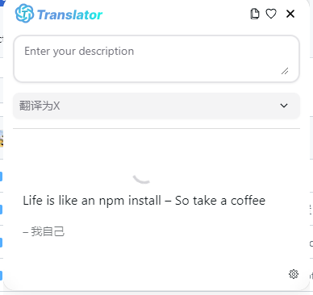

# OpenAiTranslator

> 考虑到快速MVP，目前关掉了cz以及基本的 husky 限定


## :sparkles: 功能点

- [x] Streaming mode is supported!
- [x] It allows users to customize their translation text.
- [x] One-click copying
- [x] Supports both OpenAI and Azure OpenAI Service at the same time
- [ ] Our tool allows for mutual translation, polishing and summarization across 55 different languages.
- [ ] It offers three modes: translation, polishing and summarization.
- [ ] Text-to-Speech (TTS)
- [ ] Support screenshot translation
- [ ] Support for vocabulary books, as well as support for generating memory aids based on the words in the vocabulary
  books

## :rocket: 部署引擎

```sh
docker run -d -p 8080:8080 -p 1337:1337 -p 7900:7900 --shm-size="2g" -v ${PWD}/hardir:/app/hardir hlohaus789/g4f:latest
```

## :camera_flash: 快照



